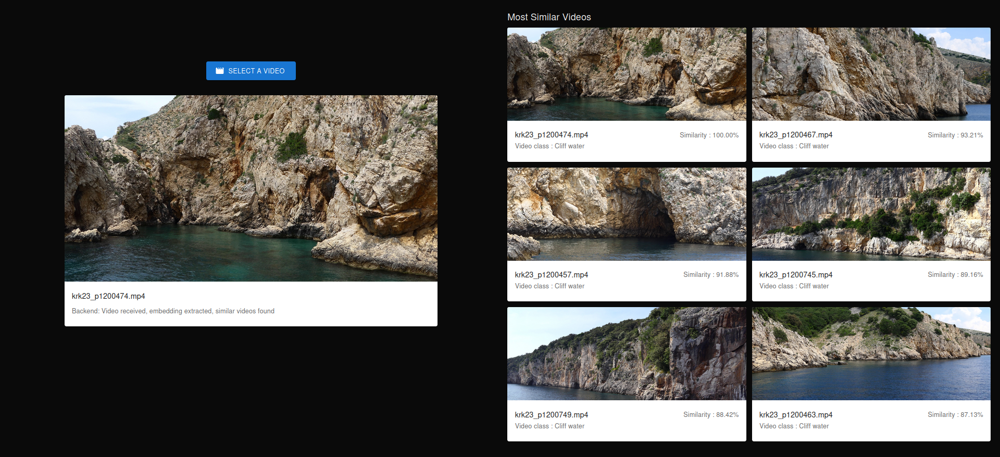
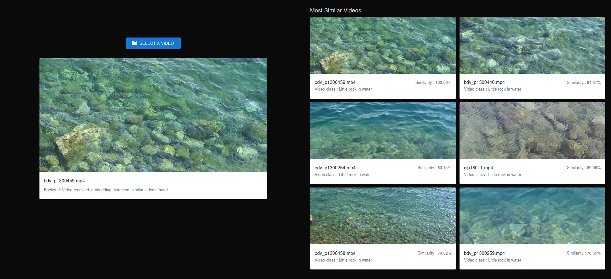
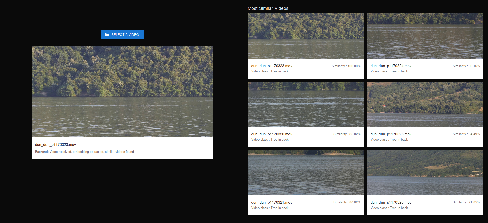

# **video-search-similarity**

This project was developed as part of a research internship at Politehnica University of Timișoara in the field of computer vision.
Its goal is to detect and retrieve video patterns of similarity in ocean, river, and stream footage.

The application enables video search by similarity using **EfficientNet-B4 embeddings** and the **cosine similarity** method for comparison.
A **ChromaDB vector database** is used to store and query embeddings efficiently.
The frontend is built with **Next.js** and **MUI**, while the backend is implemented in **Python (FastAPI)**.

---

## Intallation

### 1. Set up the video database
```bash
cd backend
python -m venv venv && source venv/bin/activate
pip install -r requirements.txt
mkdir videos_database
```

The application supports the following video formats: .mp4, .avi, and .mov.

First, create a videos_database folder inside the backend directory.
Then, add subfolders named after the classes of interest, and place your videos inside these subfolders.
If a class name contains multiple words, please use underscores (_) instead of spaces.

Example folder structure:

```bash
└── videos_database
    ├── beach_and_waves
    ├── big_rocks
    ├── blue_water
    ├── boat
    ├── cliff_water
    ├── dirty_water
    └── water_tree_reflect
```

### 2. Generate embeddings

From the backend directory, run:

```bash
python utils/process_videos.py
```

This script will generate embeddings for each video as well as thumbnails for display in the application.
Execution time may vary depending on the size of your video database.

### 3. Start the backend server

Still in the backend directory, run:

```bash
uvicorn main:app --reload
```

### 4. Launch the frontend application

```bash
cd ../frontend
npm install
npm run dev
```

---

## Demonstration

For performance reasons, the full video is not displayed in the web application.
Instead, the application shows the **video filename** along with its **first frame (thumbnail)**, similar to how YouTube displays video previews.
Additionally, the **similarity percentage** between the query image and the images in the database is shown.

For testing purposes, I used videos with relatively distinct content:
- a video of a cliff,
- a video of rocks in turquoise water,
- and a video of a forest by a river.







---
---

## **Explanations and comparisons**

### What is an embedding?

An embedding is basically a way to turn a complex piece of data, like an image or a video frame, into a vector of numbers.
Instead of storing all the raw pixels (which would be huge and not very useful for comparison), a deep learning model like EfficientNet processes the frame and outputs a feature vector. This vector is called an **embedding**.

You can think of it as a kind of "summary" of the image: it keeps the most important information about what is in the frame, but in a compact numerical form. Two images that look similar to humans will usually have embeddings that are close to each other in this vector space.

The embedding does not directly store things like “this is water” or “this is a rock” in plain text. Instead, it encodes **patterns and visual properties** that the neural network has learned to recognize. Here are some of the main aspects that are captured in the vector:

1. **Colors and textures**
   - The model detects overall color distributions (e.g., turquoise water vs. dark muddy water).
   - It also captures texture information, like the difference between smooth water, rough waves, or sharp rock surfaces.

2. **Shapes and edges**
   - Embeddings contain signals about the geometry of objects. For example, cliffs have strong vertical edges, while trees have more irregular shapes.
   - This helps the model understand the structure of what’s in the image, beyond just color.

3. **Objects and patterns**
   - Thanks to training on large datasets, the model has learned to recognize high-level concepts like “boat,” “tree,” or “person.”
   - Even if it doesn’t give a label, these object features are reflected in the vector.

4. **Spatial relationships**
   - Embeddings also keep some information about how objects are arranged. For instance, water below a cliff looks different from water next to grass.
   - It’s not as precise as exact coordinates, but enough to distinguish scenes.

5. **Contextual cues**
   - Sometimes the “feeling” of a scene is captured: a calm blue ocean vs. a stormy grey sea will produce different embeddings because of the global combination of colors, textures, and shapes.

When you compare two embeddings, you’re basically comparing these abstract features.
If two videos share similar colors, textures, objects, and patterns, their embeddings will be close to each other in the vector space.
That’s why you can measure similarity with something like **cosine similarity** or **Euclidean distance** between embeddings: smaller distance = more similar videos.

So, in short, the embedding is a numerical fingerprint of each video frame. By looking at these fingerprints instead of raw pixels, the application can quickly figure out which videos are most alike.

---
